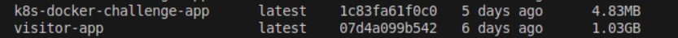

# Go App with Redis - DevOps Challenge

This repository contains the fixed and enhanced version of a Go web application that uses Redis for caching visitor counts. It includes:
- A revised Dockerfile and Go source code with necessary bug fixes and image size optimizations.
- Kubernetes YAML files to deploy the application (as a stateless workload in the `app` namespace) and Redis (as a stateful workload in the `db` namespace with persistent storage and proper networking).
- A Docker Compose file for local multi-container testing (Go app + Redis).

## Challenge Overview

**DevOps Challenge: Fix & Deploy Go App with Redis**

- **Part 1: Fix the Dockerfile and Go Application**
  - Troubleshoot and fix issues in the provided Dockerfile and Go code so that the app can build and run successfully.
  - The Go app uses Redis to cache the number of visitors.
  - **Bonus:** Optimize the Go app image size.

- **Part 2: Deploy to Kubernetes**
  - Create Kubernetes YAML files to deploy:
    - The Go application as a stateless workload (namespace: `app`).
    - Redis as a stateful workload (namespace: `db`) with persistent storage and a headless service for internal communication.
  - Use Kubernetes-native variable management.
  - Expose the Go app using a NodePort or LoadBalancer service.
  - Redis is exposed internally.

## Project Structure


## Fixes & Enhancements

### Dockerfile
- **Base Image Optimization:** Switched to a multi-stage build using a lightweight base image (e.g., `alpine` or `scratch`) to reduce the final image size.
- **Dependency Management:** Ensured `go.mod` and `go.sum` files are copied first for layer caching.
- **Correct Build & CMD:** Fixed build commands and the executable path in the final stage CMD ["bin/myapp"] to CMD ["app/myapp"].



### Go Application
- **Redis Connection:** Improved the formatting for reading environment variables for `REDIS_HOST` and `REDIS_PORT`.
- **Error Handling:** Added proper error handling when converting visit count values and setting data in Redis.
- **Default Values:** Provided default values using helper functions to ensure the app runs even if environment variables are missing.

### Kubernetes Deployment
- **Namespaces:** The application is deployed in two namespaces:
  - `app` – for the Go application.
  - `db` – for Redis.
- **Persistent Storage:** Redis StatefulSet uses `volumeClaimTemplates` to dynamically provision persistent storage.
- **Headless Service:** A headless service (`redis-headless`) is used to allow direct pod-to-pod communication for Redis.
- **InitContainer:** The Go app deployment includes an initContainer that waits for Redis connectivity before starting the main container.

## How to Run Locally

### Using Docker Compose

1. **Build and Run the Stack:**
   ```sh
   docker-compose up --build
