# Go App with Redis - DevOps Challenge

This repository contains the fixed and enhanced version of a Go web application that uses Redis for caching visitor counts. It includes:
- A revised Dockerfile and Go source code with necessary bug fixes and image size optimizations.
- Kubernetes YAML files to deploy the application (as a stateless workload in the `app` namespace) and Redis (as a stateful workload in the `db` namespace with persistent storage and proper networking).
- A Docker Compose file for local multi-container testing (Go app + Redis).

## Challenge Overview

**DevOps Challenge: Fix & Deploy Go App with Redis**

- **Part 1: Fix the Dockerfile and Go Application**
  - Troubleshoot and fix issues in the provided Dockerfile and Go code so that the app can build and run successfully.
  - The Go app uses Redis to cache the number of visitors.
  - **Bonus:** Optimize the Go app image size.

- **Part 2: Deploy to Kubernetes**
  - Create Kubernetes YAML files to deploy:
    - The Go application as a stateless workload (namespace: `app`).
    - Redis as a stateful workload (namespace: `db`) with persistent storage and a headless service for internal communication.
  - Use Kubernetes-native variable management.
  - Expose the Go app using a NodePort or LoadBalancer service.
  - Redis is exposed internally.

## Project Structure

```
.
├── Dockerfile
├── docker-compose.yml
├── k8s
│   ├── go-app-deployment.yaml
│   ├── redis-statefulset.yaml
│   └── services.yaml
└── app
    ├── main.go
    ├── go.mod
    └── go.sum
```

## Fixes & Enhancements

### Dockerfile
- **Base Image Optimization:** Switched to a multi-stage build using a lightweight base image (e.g., `alpine` or `scratch`) to reduce the final image size.
- **Dependency Management:** Ensured `go.mod` and `go.sum` files are copied first for layer caching.
- **Correct Build & CMD:** Fixed build commands and the executable path in the final stage from `CMD ["/bin/myapp"]` to `CMD ["./main"]`.

### Go Application
- **Error Handling:** Added proper error handling when converting visit count values and setting data in Redis.
- **Default Values:** Provided default values using helper functions to ensure the app runs even if environment variables are missing.

### Kubernetes Deployment
- **Namespaces:** The application is deployed in two namespaces:
  - `app` – for the Go application.
  - `db` – for Redis.

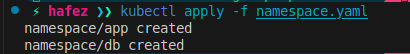
  
- **Persistent Storage:** Redis StatefulSet uses `volumeClaimTemplates` to dynamically provision persistent storage.
- **Go App Service:** A `NodePort service`is used to expose the Go application externally, allowing users to access it via a specific port on the node. This facilitates easy testing and access without requiring a LoadBalancer.
- **Redis Headless Service:** A `headless service` is implemented for Redis, enabling direct pod-to-pod communication within the cluster. This is crucial for stateful applications like Redis, as it allows the Go app to connect directly to the Redis pod without a load balancer, ensuring low-latency access.
- **StatefulSet for Redis:** Redis is deployed using a StatefulSet, which provides stable network identities and persistent storage through volumeClaimTemplates. This ensures data persistence across pod restarts and is essential for maintaining the integrity of cached data.
- **InitContainer:** An `initContainer` is included in the Go app deployment to ensure that the application only starts after Redis is fully operational. This prevents connection errors during startup, enhancing the reliability of the application.

## How to Run Locally

### Using Docker Compose

1. **Build and Run the Stack:**

   ```sh
   docker-compose up --build
   ```
   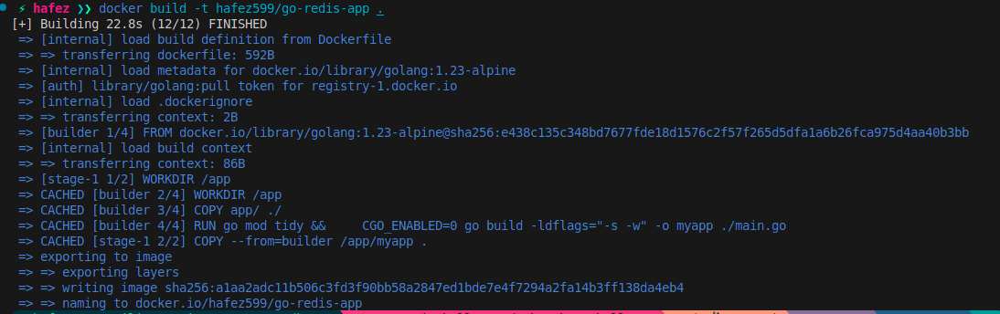

1. **Uploaded local image to docker hub publicly hafez599/go-redis-app:v1**

   ```sh
   docker push hafez599/go-redis-app:v1
   ```
   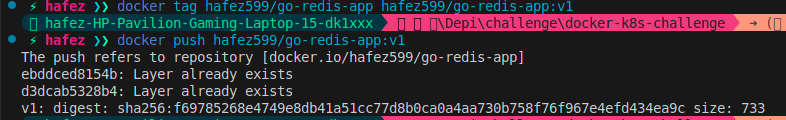

2. **Access the Application:**
   - Open your browser and navigate to `http://localhost:8080` to see the visitor count.

## Kubernetes Deployment Instructions

1. **Apply the Kubernetes Manifests:**

   ```sh
    kubectl apply -f namespace.yaml

    kubectl apply -f redis-statefulset.yaml

    kubectl apply -f redis-headless-service.yaml

    kubectl apply -f go-app-deployment.yaml

    kubectl apply -f go-app-service.yaml
   ```
    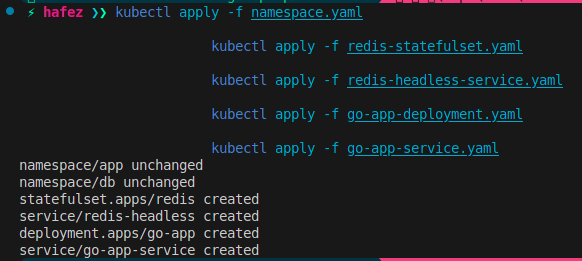

    **The app pod will not run until redis pod run successfully**

    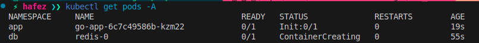

2. **Check the Status of Deployments:**

   ```sh
   kubectl get all -n app
   ```
    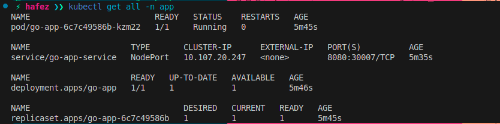

   ```sh
   kubectl get all -n db
   ```
    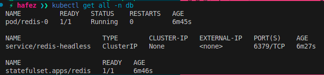
3. **Access the Go App:**
   - Get the NodePort assigned:

   ```sh
   minikube ip
   kubectl get services -n app
   ```
    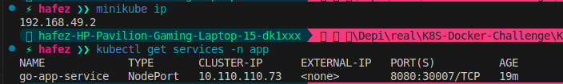
   - Open your browser and navigate to `http://192.168.49.2:30007/`.

      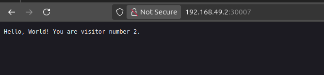
   - Using curl command.

      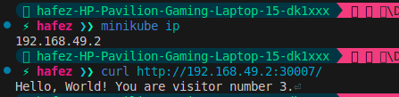

## Evidence of Work

- **Docker Image Size:** The optimized image size can be verified using:

  ```sh
  docker images
  ```
  

- **Kubernetes Logs:** Check logs for both Go app and Redis:

  ```sh
  kubectl logs go-app-6c7c49586b-cqqx9 --namespace app
  ```
  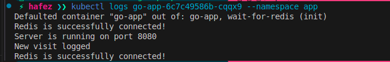

  ```sh
  kubectl logs redis-0  --namespace db
  ```
  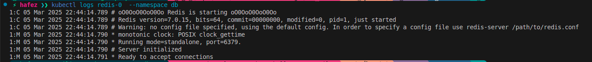

   - Redis persistent storage.
  ```sh
  kubectl describe pod redis-0 -n db
  ```
  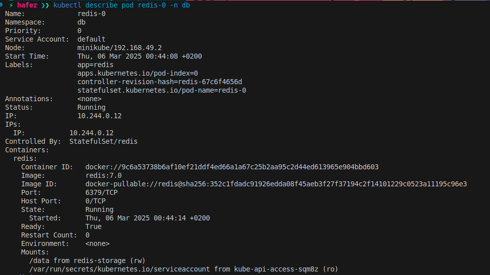

  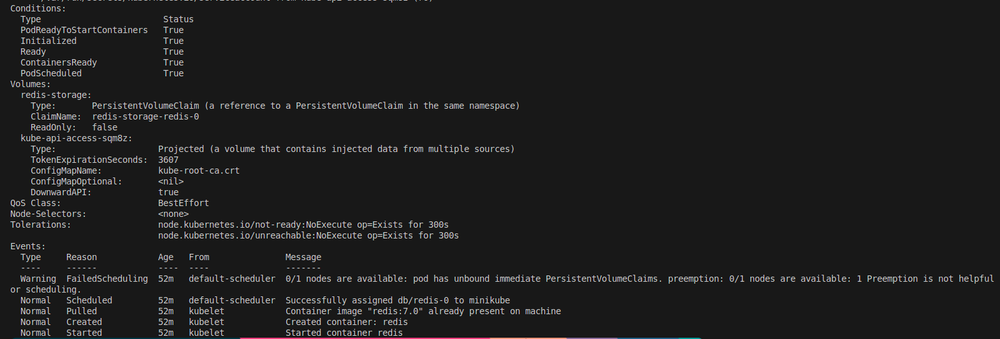
